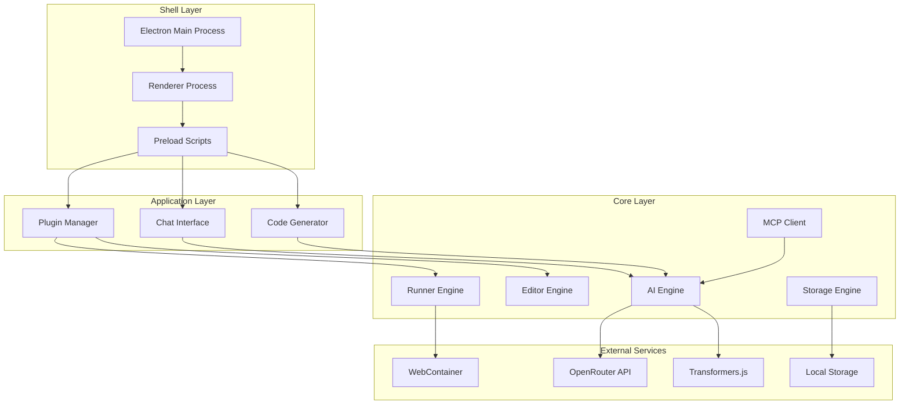

# Design Document

## Overview

RunJS Local + AI is architected as a modular Electron application with a clean separation between core systems, application features, and shell integration. The design emphasizes security through WebContainer sandboxing, extensibility through a plugin system, and intelligent assistance through multi-provider AI integration.

## Architecture

### High-Level Architecture



### Process Architecture

The application follows Electron's multi-process architecture:

- **Main Process**: Manages application lifecycle, window creation, and system integration
- **Renderer Process**: Hosts the React-based UI and core application logic
- **Preload Scripts**: Provide secure communication bridge between main and renderer processes

## Components and Interfaces

### Core Runner Engine (core/runner)

The Runner Engine orchestrates WebContainer instances and manages code execution.

```typescript
interface RunnerEngine {
  // Lifecycle management
  init(): Promise<void>
  destroy(): Promise<void>
  
  // File operations
  writeFile(path: string, content: string): Promise<void>
  readFile(path: string): Promise<string>
  deleteFile(path: string): Promise<void>
  listFiles(directory: string): Promise<string[]>
  
  // Execution
  runFile(path: string): Promise<ExecutionResult>
  runCode(code: string): Promise<ExecutionResult>
  
  // Output streaming
  onOutput(callback: (output: OutputEvent) => void): void
  onError(callback: (error: ErrorEvent) => void): void
  
  // Process management
  killProcess(): Promise<void>
  getProcessStatus(): ProcessStatus
}

interface ExecutionResult {
  success: boolean
  output: string
  error?: string
  duration: number
  timestamp: Date
}

interface OutputEvent {
  type: 'stdout' | 'stderr' | 'log'
  content: string
  timestamp: Date
}
```

**Implementation Details:**
- Uses WebContainer API for secure sandboxed execution
- Maintains virtual file system state
- Provides real-time output streaming through event emitters
- Handles process lifecycle and cleanup

### Editor Engine (core/editor)

The Editor Engine provides a CodeMirror v6 abstraction with AI integration.

```typescript
interface EditorEngine {
  // Content management
  setContent(content: string): void
  getContent(): string
  getSelection(): Selection
  setSelection(selection: Selection): void
  
  // Language support
  setLanguage(language: 'javascript' | 'typescript'): void
  getLanguage(): string
  
  // Event handling
  onChange(callback: (content: string) => void): void
  onSelectionChange(callback: (selection: Selection) => void): void
  onCursorMove(callback: (position: Position) => void): void
  
  // AI integration
  requestCompletion(position: Position): Promise<CompletionItem[]>
  requestRefactor(selection: Selection, instruction: string): Promise<string>
  
  // Buffer management
  createBuffer(id: string): Buffer
  switchBuffer(id: string): void
  closeBuffer(id: string): void
  listBuffers(): Buffer[]
}

interface Buffer {
  id: string
  content: string
  language: string
  modified: boolean
  path?: string
}
```

**Implementation Details:**
- Built on CodeMirror v6 with custom extensions
- Supports multiple buffers with tab interface
- Integrates with AI Engine for intelligent features
- Provides syntax highlighting and linting

### AI Engine (core/ai-engine)

The AI Engine provides unified access to multiple AI providers with intelligent routing.

```typescript
interface AIEngine {
  // Provider management
  addProvider(provider: AIProvider): void
  removeProvider(providerId: string): void
  setProviderPriority(providerId: string, priority: number): void
  
  // Core AI operations
  ask(prompt: string, context?: AIContext): Promise<string>
  completeCode(code: string, position: number): Promise<string>
  explainCode(code: string): Promise<string>
  generateFunction(description: string, context?: AIContext): Promise<string>
  refactorCode(code: string, instruction: string): Promise<string>
  
  // Conversation management
  startConversation(): ConversationId
  continueConversation(id: ConversationId, message: string): Promise<string>
  endConversation(id: ConversationId): void
  
  // Streaming support
  askStream(prompt: string, callback: (chunk: string) => void): Promise<void>
}

interface AIProvider {
  id: string
  name: string
  type: 'remote' | 'local'
  capabilities: AICapability[]
  
  ask(prompt: string, context?: AIContext): Promise<string>
  complete(code: string): Promise<string>
  isAvailable(): Promise<boolean>
}

interface AIContext {
  currentFile?: string
  selection?: string
  projectStructure?: FileTree
  executionHistory?: ExecutionResult[]
}
```

**Implementation Details:**
- Supports OpenRouter, Transformers.js, AI SDK, and LangChain.js
- Implements provider fallback and load balancing
- Maintains conversation context and history
- Provides streaming responses for real-time interaction

### Plugin System (core/plugin)

The Plugin System enables safe extension of application functionality.

```typescript
interface PluginSystem {
  // Plugin lifecycle
  loadPlugin(path: string): Promise<Plugin>
  unloadPlugin(id: string): Promise<void>
  reloadPlugin(id: string): Promise<void>
  
  // Plugin management
  listPlugins(): Plugin[]
  getPlugin(id: string): Plugin | null
  enablePlugin(id: string): void
  disablePlugin(id: string): void
  
  // API provision
  createPluginAPI(plugin: Plugin): PluginAPI
}

interface Plugin {
  id: string
  name: string
  version: string
  description: string
  author: string
  
  // Lifecycle hooks
  activate(api: PluginAPI): Promise<void>
  deactivate(): Promise<void>
  
  // Event handlers
  onRun?(context: RunContext): void
  onBufferChange?(buffer: Buffer): void
  onSave?(buffer: Buffer): void
  onAIResponse?(response: string, context: AIContext): void
}

interface PluginAPI {
  // Core access
  editor: EditorAPI
  runner: RunnerAPI
  ai: AIAPI
  storage: StorageAPI
  
  // UI integration
  registerCommand(id: string, handler: CommandHandler): void
  showPanel(component: React.ComponentType): void
  showNotification(message: string, type: NotificationType): void
  
  // Event system
  on(event: string, handler: EventHandler): void
  emit(event: string, data: any): void
}
```

**Implementation Details:**
- Sandboxed plugin execution environment
- Controlled API access with permission system
- Support for local and npm-based plugins
- Event-driven architecture for plugin communication

### MCP Client (core/mcp)

The MCP Client provides rich context to AI providers following the Model Context Protocol.

```typescript
interface MCPClient {
  // Context collection
  getCurrentContext(): Promise<MCPContext>
  getProjectContext(): Promise<ProjectContext>
  getExecutionContext(): Promise<ExecutionContext>
  
  // Context streaming
  onContextChange(callback: (context: MCPContext) => void): void
  
  // Action execution
  executeAction(action: MCPAction): Promise<ActionResult>
  
  // Provider integration
  registerProvider(provider: MCPProvider): void
  unregisterProvider(providerId: string): void
}

interface MCPContext {
  buffer: {
    content: string
    language: string
    selection?: Selection
    cursor: Position
  }
  project: {
    structure: FileTree
    config: ProjectConfig
    dependencies: PackageInfo[]
  }
  execution: {
    history: ExecutionResult[]
    currentProcess?: ProcessInfo
  }
  user: {
    preferences: UserPreferences
    recentActions: UserAction[]
  }
}

interface MCPAction {
  type: 'refactor' | 'rename' | 'document' | 'generate' | 'explain'
  target: ActionTarget
  parameters: Record<string, any>
}
```

**Implementation Details:**
- Real-time context collection and updates
- Integration with all core systems
- Support for multiple MCP providers
- Action execution with rollback capabilities

## Data Models

### Project Structure

```typescript
interface Project {
  id: string
  name: string
  path: string
  type: 'javascript' | 'typescript' | 'mixed'
  
  files: ProjectFile[]
  config: ProjectConfig
  dependencies: PackageDependency[]
  
  createdAt: Date
  updatedAt: Date
}

interface ProjectFile {
  path: string
  content: string
  language: string
  modified: boolean
  size: number
}

interface ProjectConfig {
  entry?: string
  tsconfig?: TSConfig
  packageJson?: PackageJson
  buildSettings?: BuildSettings
}
```

### Execution History

```typescript
interface ExecutionHistory {
  id: string
  projectId?: string
  code: string
  result: ExecutionResult
  context: ExecutionContext
  timestamp: Date
}

interface ExecutionContext {
  language: string
  dependencies: string[]
  environment: Record<string, string>
  flags: ExecutionFlag[]
}
```

### AI Conversation

```typescript
interface Conversation {
  id: string
  title: string
  messages: ConversationMessage[]
  context: AIContext
  provider: string
  createdAt: Date
  updatedAt: Date
}

interface ConversationMessage {
  id: string
  role: 'user' | 'assistant' | 'system'
  content: string
  timestamp: Date
  metadata?: MessageMetadata
}
```

## Error Handling

### Error Categories

1. **Execution Errors**: Code runtime errors, syntax errors, timeout errors
2. **AI Errors**: Provider unavailable, quota exceeded, invalid responses
3. **Plugin Errors**: Plugin loading failures, API violations, crashes
4. **System Errors**: File system errors, network errors, configuration errors

### Error Handling Strategy

```typescript
interface ErrorHandler {
  handleExecutionError(error: ExecutionError): Promise<void>
  handleAIError(error: AIError): Promise<void>
  handlePluginError(error: PluginError): Promise<void>
  handleSystemError(error: SystemError): Promise<void>
}

interface ErrorRecovery {
  canRecover(error: AppError): boolean
  recover(error: AppError): Promise<RecoveryResult>
  fallback(error: AppError): Promise<void>
}
```

**Error Handling Principles:**
- Graceful degradation for non-critical failures
- User-friendly error messages with actionable suggestions
- Automatic recovery for transient errors
- Comprehensive logging for debugging

## Testing Strategy

### Unit Testing

- **Core Modules**: Test all core engines in isolation
- **Plugin System**: Test plugin loading, API access, and sandboxing
- **AI Integration**: Mock AI providers for consistent testing
- **Data Models**: Validate serialization and business logic

### Integration Testing

- **WebContainer Integration**: Test code execution scenarios
- **AI Provider Integration**: Test with real AI services
- **Plugin Integration**: Test plugin lifecycle and API usage
- **Cross-Module Communication**: Test event flow and data consistency

### End-to-End Testing

- **User Workflows**: Test complete user scenarios
- **Performance Testing**: Measure execution speed and memory usage
- **Security Testing**: Validate sandboxing and isolation
- **Compatibility Testing**: Test across different operating systems

### Testing Tools

- **Jest**: Unit and integration testing framework
- **Playwright**: End-to-end testing for Electron
- **MSW**: Mock Service Worker for AI provider testing
- **WebContainer Test Suite**: Validate execution capabilities

## Security Considerations

### Sandboxing

- WebContainer provides process-level isolation
- No access to host file system or system resources
- Network access controlled and monitored
- Plugin execution in restricted environment

### Data Protection

- Local storage encryption for sensitive data
- Secure communication with AI providers
- User consent for data sharing with AI services
- Audit logging for security events

### Plugin Security

- Plugin signature verification
- API access control and permissions
- Resource usage monitoring and limits
- Isolation between plugins

## Performance Optimization

### Code Execution

- WebContainer instance pooling
- Incremental compilation for TypeScript
- Output streaming for large results
- Process cleanup and memory management

### AI Integration

- Response caching for repeated queries
- Provider load balancing
- Streaming responses for better UX
- Context optimization to reduce token usage

### UI Performance

- Virtual scrolling for large outputs
- Debounced editor updates
- Lazy loading of plugin components
- Efficient state management with React

## Deployment and Distribution

### Build Process

- Electron Builder for cross-platform packaging
- Code signing for security and trust
- Automated testing in CI/CD pipeline
- Asset optimization and bundling

### Distribution Channels

- Direct download from project website
- GitHub Releases for open source distribution
- Future: Package managers (Homebrew, Chocolatey, etc.)
- Auto-updater for seamless updates

### Platform Support

- **Primary**: Windows 10+, macOS 10.15+, Ubuntu 18.04+
- **Architecture**: x64, ARM64 (Apple Silicon)
- **Dependencies**: Node.js runtime embedded in Electron