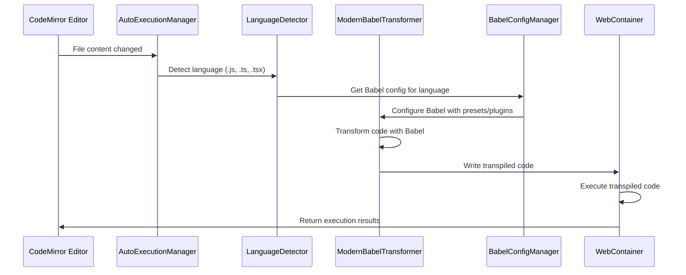

# Design Document

## Overview

The WebContainer Babel Modernization enhances the existing OrbisJS application with a comprehensive, modern JavaScript/TypeScript transpilation system. The design builds upon the current `BabelTransformer` implementation, replacing the CDN-based Babel loading with a robust, local Babel ecosystem that supports auto-execution, advanced language features, and extensible framework support.

The modernization focuses on three core improvements:
1. **Enhanced Babel Integration**: Replace CDN-based loading with proper npm-based Babel packages
2. **Auto-Execution Pipeline**: Implement file watching and automatic transpilation/execution
3. **Extensible Framework Support**: Create a plugin architecture for React, Solid, Vue, and future frameworks

## Architecture

### High-Level Architecture

```mermaid
graph TB
    subgraph "Enhanced Runner Engine"
        A[WebContainerRunner]
        B[ModernBabelTransformer]
        C[AutoExecutionManager]
        D[LanguageDetector]
    end
    
    subgraph "Babel Ecosystem"
        E[@babel/core]
        F[@babel/preset-env]
        G[@babel/preset-typescript]
        H[Framework Presets]
        I[Custom Plugins]
    end
    
    subgraph "WebContainer Environment"
        J[Package Manager]
        K[File System]
        L[Process Executor]
        M[Dependency Installer]
    end
    
    subgraph "Configuration System"
        N[BabelConfigManager]
        O[ProjectConfigDetector]
        P[PresetRegistry]
    end
    
    A --> B
    A --> C
    B --> D
    B --> E
    C --> A
    E --> F
    E --> G
    E --> H
    E --> I
    B --> N
    N --> O
    N --> P
    A --> J
    J --> K
    J --> L
    J --> M
```

### Component Interaction Flow



## Components and Interfaces

### ModernBabelTransformer

The enhanced Babel transformer replaces the current CDN-based implementation with a comprehensive npm-based solution.

```typescript
interface ModernBabelTransformer {
  // Core transformation methods
  transformCode(code: string, options: TransformOptions): Promise<TransformResult>
  transformFile(filePath: string, options: TransformOptions): Promise<TransformResult>
  
  // Language-specific transformations
  transformJavaScript(code: string, config?: JavaScriptConfig): Promise<TransformResult>
  transformTypeScript(code: string, config?: TypeScriptConfig): Promise<TransformResult>
  transformJSX(code: string, framework: 'react' | 'solid' | 'vue'): Promise<TransformResult>
  
  // Configuration management
  setGlobalConfig(config: BabelGlobalConfig): void
  getActiveConfig(): BabelGlobalConfig
  validateConfig(config: BabelGlobalConfig): ValidationResult
  
  // Plugin and preset management
  registerPreset(name: string, preset: BabelPreset): void
  registerPlugin(name: string, plugin: BabelPlugin): void
  getAvailablePresets(): PresetInfo[]
  getAvailablePlugins(): PluginInfo[]
  
  // Performance and caching
  clearCache(): void
  getCacheStats(): CacheStats
  enableSourceMaps(enabled: boolean): void
}

interface TransformOptions {
  filename?: string
  language?: SupportedLanguage
  framework?: SupportedFramework
  target?: TargetEnvironment
  sourceMaps?: boolean
  minify?: boolean
  customConfig?: Partial<BabelGlobalConfig>
}

interface TransformResult {
  code: string
  map?: SourceMap
  ast?: BabelAST
  metadata: TransformMetadata
  performance: PerformanceMetrics
}

interface TransformMetadata {
  originalSize: number
  transformedSize: number
  appliedPresets: string[]
  appliedPlugins: string[]
  warnings: TransformWarning[]
  dependencies: string[]
}
```

**Implementation Details:**
- Uses `@babel/core` for programmatic transformation
- Implements caching for repeated transformations
- Supports incremental compilation for large files
- Provides detailed error reporting with source mapping
- Integrates with WebContainer's file system for optimal performance

### AutoExecutionManager

Manages automatic code execution when files change, with configurable debouncing and execution strategies.

```typescript
interface AutoExecutionManager {
  // Auto-execution control
  enable(): void
  disable(): void
  isEnabled(): boolean
  
  // File watching
  watchFile(filePath: string, options?: WatchOptions): void
  unwatchFile(filePath: string): void
  watchDirectory(dirPath: string, options?: WatchOptions): void
  
  // Execution strategies
  setExecutionStrategy(strategy: ExecutionStrategy): void
  setDebounceDelay(milliseconds: number): void
  
  // Event handling
  onBeforeExecution(callback: BeforeExecutionCallback): void
  onAfterExecution(callback: AfterExecutionCallback): void
  onExecutionError(callback: ExecutionErrorCallback): void
  
  // Manual control
  executeNow(filePath?: string): Promise<ExecutionResult>
  cancelExecution(): void
  getExecutionStatus(): ExecutionStatus
}

interface WatchOptions {
  debounceDelay?: number
  includePatterns?: string[]
  excludePatterns?: string[]
  recursive?: boolean
}

interface ExecutionStrategy {
  type: 'immediate' | 'debounced' | 'manual'
  delay?: number
  batchSize?: number
  priority?: 'speed' | 'accuracy'
}

interface ExecutionStatus {
  isRunning: boolean
  currentFile?: string
  queuedFiles: string[]
  lastExecution?: Date
  executionCount: number
}
```

**Implementation Details:**
- Uses efficient file watching with minimal resource usage
- Implements intelligent debouncing to avoid excessive executions
- Supports batch execution for multiple file changes
- Provides execution queuing and prioritization
- Integrates with the existing WebContainerRunner

### LanguageDetector

Enhanced language detection that goes beyond file extensions to analyze code content and determine optimal transpilation strategies.

```typescript
interface LanguageDetector {
  // Primary detection methods
  detectFromFile(filePath: string): Promise<LanguageInfo>
  detectFromContent(code: string, filename?: string): LanguageInfo
  detectFromExtension(extension: string): LanguageInfo
  
  // Advanced detection
  detectFramework(code: string): FrameworkInfo[]
  detectFeatures(code: string): LanguageFeature[]
  detectDependencies(code: string): DependencyInfo[]
  
  // Configuration
  registerLanguagePattern(language: string, pattern: RegExp): void
  setDetectionStrategy(strategy: DetectionStrategy): void
  
  // Validation
  validateLanguageSupport(language: string): boolean
  getSupportedLanguages(): SupportedLanguage[]
}

interface LanguageInfo {
  language: SupportedLanguage
  confidence: number
  features: LanguageFeature[]
  framework?: SupportedFramework
  version?: string
  requiresTranspilation: boolean
}

interface FrameworkInfo {
  name: SupportedFramework
  version?: string
  confidence: number
  requiredPresets: string[]
  requiredPlugins: string[]
}

interface LanguageFeature {
  name: string
  type: 'syntax' | 'api' | 'import'
  support: FeatureSupport
  requiredPlugin?: string
}

interface FeatureSupport {
  native: boolean
  transpilable: boolean
  minimumVersion?: string
}
```

**Implementation Details:**
- Analyzes AST for accurate language feature detection
- Maintains a database of language patterns and features
- Supports custom language pattern registration
- Provides confidence scoring for detection results
- Integrates with Babel's parser for syntax analysis

### BabelConfigManager

Manages Babel configurations with support for project-specific settings, preset combinations, and dynamic configuration updates.

```typescript
interface BabelConfigManager {
  // Configuration management
  loadConfig(projectPath?: string): Promise<BabelGlobalConfig>
  saveConfig(config: BabelGlobalConfig, projectPath?: string): Promise<void>
  resetToDefaults(): void
  
  // Dynamic configuration
  updateConfig(updates: Partial<BabelGlobalConfig>): void
  getConfigForLanguage(language: SupportedLanguage): BabelLanguageConfig
  getConfigForFramework(framework: SupportedFramework): BabelFrameworkConfig
  
  // Preset and plugin management
  installPreset(name: string, version?: string): Promise<void>
  installPlugin(name: string, version?: string): Promise<void>
  uninstallPreset(name: string): Promise<void>
  uninstallPlugin(name: string): Promise<void>
  
  // Configuration validation
  validateConfig(config: BabelGlobalConfig): ValidationResult
  testConfig(config: BabelGlobalConfig, testCode: string): Promise<TestResult>
  
  // Import/Export
  exportConfig(format: 'json' | 'js' | 'babelrc'): string
  importConfig(configString: string, format: 'json' | 'js' | 'babelrc'): BabelGlobalConfig
}

interface BabelGlobalConfig {
  presets: PresetConfig[]
  plugins: PluginConfig[]
  targets: TargetConfig
  sourceType: 'module' | 'script' | 'unambiguous'
  assumptions: Record<string, boolean>
  parserOpts: ParserOptions
  generatorOpts: GeneratorOptions
  env: Record<string, Partial<BabelGlobalConfig>>
}

interface PresetConfig {
  name: string
  options?: Record<string, any>
  enabled: boolean
  order: number
}

interface PluginConfig {
  name: string
  options?: Record<string, any>
  enabled: boolean
  order: number
  condition?: string
}

interface TargetConfig {
  browsers?: string[]
  node?: string
  esmodules?: boolean
  custom?: Record<string, string>
}
```

**Implementation Details:**
- Supports standard Babel configuration formats (.babelrc, babel.config.js, package.json)
- Provides intelligent defaults based on detected project type
- Implements configuration inheritance and environment-specific overrides
- Validates configurations against available presets and plugins
- Supports hot-reloading of configuration changes

## Data Models

### Project Configuration

```typescript
interface ProjectConfig {
  id: string
  name: string
  type: ProjectType
  babelConfig: BabelGlobalConfig
  autoExecution: AutoExecutionConfig
  dependencies: ProjectDependency[]
  files: ProjectFile[]
  settings: ProjectSettings
  createdAt: Date
  updatedAt: Date
}

interface ProjectType {
  primary: 'javascript' | 'typescript' | 'mixed'
  frameworks: SupportedFramework[]
  target: TargetEnvironment
  moduleSystem: 'esm' | 'commonjs' | 'mixed'
}

interface AutoExecutionConfig {
  enabled: boolean
  strategy: ExecutionStrategy
  watchPatterns: string[]
  ignorePatterns: string[]
  debounceDelay: number
}

interface ProjectDependency {
  name: string
  version: string
  type: 'dependency' | 'devDependency' | 'babel-preset' | 'babel-plugin'
  installed: boolean
  required: boolean
}
```

### Transformation Cache

```typescript
interface TransformationCache {
  entries: Map<string, CacheEntry>
  maxSize: number
  currentSize: number
  hitRate: number
  missRate: number
}

interface CacheEntry {
  key: string
  originalCode: string
  transformedCode: string
  config: BabelGlobalConfig
  metadata: TransformMetadata
  createdAt: Date
  lastAccessed: Date
  accessCount: number
  size: number
}

interface CacheStats {
  totalEntries: number
  totalSize: number
  hitRate: number
  missRate: number
  averageTransformTime: number
  cacheEfficiency: number
}
```

### Execution History

```typescript
interface ExecutionHistory {
  entries: ExecutionHistoryEntry[]
  maxEntries: number
  totalExecutions: number
  averageExecutionTime: number
  successRate: number
}

interface ExecutionHistoryEntry {
  id: string
  filePath: string
  originalCode: string
  transformedCode: string
  result: ExecutionResult
  config: BabelGlobalConfig
  performance: PerformanceMetrics
  timestamp: Date
}

interface PerformanceMetrics {
  transformTime: number
  executionTime: number
  totalTime: number
  memoryUsage: number
  cacheHit: boolean
}
```

## Error Handling

### Error Categories and Strategies

```typescript
interface ErrorHandler {
  handleTransformationError(error: TransformationError): Promise<ErrorResolution>
  handleExecutionError(error: ExecutionError): Promise<ErrorResolution>
  handleConfigurationError(error: ConfigurationError): Promise<ErrorResolution>
  handleDependencyError(error: DependencyError): Promise<ErrorResolution>
}

interface TransformationError extends Error {
  type: 'syntax' | 'plugin' | 'preset' | 'configuration'
  code: string
  line?: number
  column?: number
  filename?: string
  babelError: BabelError
  suggestions: ErrorSuggestion[]
}

interface ErrorResolution {
  resolved: boolean
  action: 'retry' | 'fallback' | 'skip' | 'manual'
  message: string
  suggestions: ErrorSuggestion[]
  fallbackResult?: TransformResult
}

interface ErrorSuggestion {
  type: 'config' | 'dependency' | 'syntax' | 'plugin'
  description: string
  action: string
  autoApplicable: boolean
}
```

**Error Handling Strategies:**

1. **Transformation Errors**: Provide detailed syntax error reporting with line/column information and suggestions
2. **Configuration Errors**: Validate configurations and suggest corrections for invalid settings
3. **Dependency Errors**: Automatically attempt to install missing Babel presets/plugins
4. **Execution Errors**: Map runtime errors back to original source code using source maps
5. **Fallback Strategies**: Gracefully degrade to simpler transformations when advanced features fail

## Testing Strategy

### Unit Testing

```typescript
interface TestSuite {
  // Transformer testing
  testBasicTransformation(): Promise<TestResult>
  testLanguageDetection(): Promise<TestResult>
  testConfigurationManagement(): Promise<TestResult>
  testCachePerformance(): Promise<TestResult>
  
  // Integration testing
  testWebContainerIntegration(): Promise<TestResult>
  testAutoExecution(): Promise<TestResult>
  testFrameworkSupport(): Promise<TestResult>
  
  // Performance testing
  testTransformationSpeed(): Promise<PerformanceResult>
  testMemoryUsage(): Promise<PerformanceResult>
  testCacheEfficiency(): Promise<PerformanceResult>
}

interface TestResult {
  passed: boolean
  duration: number
  errors: TestError[]
  warnings: TestWarning[]
  coverage: number
}
```

**Testing Approach:**
- **Unit Tests**: Test individual components in isolation with mocked dependencies
- **Integration Tests**: Test component interactions with real Babel and WebContainer
- **Performance Tests**: Measure transformation speed, memory usage, and cache efficiency
- **Regression Tests**: Ensure new features don't break existing functionality
- **Framework Tests**: Validate React, Solid, Vue, and other framework support

## Security Considerations

### Babel Security

- **Plugin Validation**: Verify Babel plugins before installation and execution
- **Code Sandboxing**: Ensure transformed code runs only within WebContainer sandbox
- **Configuration Sanitization**: Validate and sanitize user-provided Babel configurations
- **Dependency Management**: Control and audit Babel preset/plugin installations

### WebContainer Integration

- **File System Isolation**: Maintain WebContainer's file system isolation
- **Process Limits**: Respect WebContainer's process and resource limits
- **Network Access**: Control network access for dependency installation
- **Memory Management**: Prevent memory leaks in transformation caching

## Performance Optimization

### Transformation Performance

```typescript
interface PerformanceOptimizer {
  // Caching strategies
  enableIncrementalCompilation(): void
  optimizeCacheStrategy(): void
  implementLazyLoading(): void
  
  // Parallel processing
  enableWorkerThreads(): void
  implementBatchProcessing(): void
  optimizeMemoryUsage(): void
  
  // Monitoring
  trackPerformanceMetrics(): PerformanceMetrics
  generateOptimizationReport(): OptimizationReport
}
```

**Optimization Strategies:**

1. **Intelligent Caching**: Cache transformation results based on code content and configuration
2. **Incremental Compilation**: Only re-transform changed parts of large files
3. **Worker Threads**: Use web workers for CPU-intensive transformations
4. **Lazy Loading**: Load Babel presets and plugins only when needed
5. **Memory Management**: Implement efficient cache eviction and garbage collection
6. **Batch Processing**: Group multiple file transformations for efficiency

## WebContainer Integration

### Enhanced Package.json Configuration

```json
{
  "name": "orbisjs-webcontainer-project",
  "version": "1.0.0",
  "type": "module",
  "scripts": {
    "dev": "node --experimental-modules index.js",
    "build": "babel src --out-dir dist",
    "test": "node --test"
  },
  "dependencies": {
    "@babel/runtime": "^7.24.0"
  },
  "devDependencies": {
    "@babel/core": "^7.24.0",
    "@babel/preset-env": "^7.24.0",
    "@babel/preset-typescript": "^7.24.0",
    "@babel/preset-react": "^7.24.0",
    "@babel/plugin-transform-runtime": "^7.24.0",
    "@babel/plugin-proposal-decorators": "^7.24.0",
    "@babel/plugin-proposal-class-properties": "^7.24.0",
    "@babel/plugin-transform-optional-chaining": "^7.24.0",
    "@babel/plugin-transform-nullish-coalescing-operator": "^7.24.0"
  },
  "babel": {
    "presets": [
      ["@babel/preset-env", {
        "targets": { "node": "18" },
        "modules": "auto"
      }],
      "@babel/preset-typescript"
    ],
    "plugins": [
      "@babel/plugin-transform-runtime",
      ["@babel/plugin-proposal-decorators", { "legacy": true }],
      "@babel/plugin-proposal-class-properties",
      "@babel/plugin-transform-optional-chaining",
      "@babel/plugin-transform-nullish-coalescing-operator"
    ]
  }
}
```

### WebContainer Initialization Sequence

```typescript
interface WebContainerInitializer {
  async initializeModernEnvironment(): Promise<void> {
    // 1. Create optimal package.json
    await this.createPackageJson()
    
    // 2. Install Babel ecosystem
    await this.installBabelDependencies()
    
    // 3. Configure Node.js environment
    await this.configureNodeEnvironment()
    
    // 4. Set up file watching
    await this.setupFileWatching()
    
    // 5. Initialize transformation pipeline
    await this.initializeTransformationPipeline()
  }
}
```

## Framework Support Architecture

### Extensible Framework System

```typescript
interface FrameworkSupport {
  // Framework registration
  registerFramework(framework: FrameworkDefinition): void
  unregisterFramework(name: string): void
  getAvailableFrameworks(): FrameworkDefinition[]
  
  // Framework-specific configuration
  getFrameworkConfig(name: SupportedFramework): FrameworkConfig
  updateFrameworkConfig(name: SupportedFramework, config: Partial<FrameworkConfig>): void
  
  // Framework detection and setup
  detectFramework(code: string): FrameworkDetectionResult
  setupFramework(name: SupportedFramework): Promise<void>
}

interface FrameworkDefinition {
  name: SupportedFramework
  displayName: string
  version: string
  presets: string[]
  plugins: string[]
  dependencies: string[]
  fileExtensions: string[]
  detectionPatterns: RegExp[]
  configuration: FrameworkConfig
}

interface FrameworkConfig {
  jsx?: JSXConfig
  typescript?: TypeScriptConfig
  styling?: StylingConfig
  routing?: RoutingConfig
  stateManagement?: StateManagementConfig
}

// Framework-specific configurations
interface JSXConfig {
  pragma?: string
  pragmaFrag?: string
  runtime?: 'automatic' | 'classic'
  importSource?: string
}

interface ReactFrameworkConfig extends FrameworkConfig {
  jsx: {
    runtime: 'automatic'
    importSource: 'react'
  }
  typescript: {
    allowSyntheticDefaultImports: true
    jsx: 'react-jsx'
  }
}

interface SolidFrameworkConfig extends FrameworkConfig {
  jsx: {
    pragma: 'h'
    pragmaFrag: 'Fragment'
  }
}

interface VueFrameworkConfig extends FrameworkConfig {
  sfc: {
    script: { lang: 'ts' }
    template: { compilerOptions: {} }
    style: { scoped: true }
  }
}
```

**Framework Support Implementation:**

1. **React Support**: Configure @babel/preset-react with automatic JSX runtime
2. **Solid Support**: Set up solid-js/babel-preset-solid for reactive transformations
3. **Vue Support**: Integrate @vue/babel-preset-jsx for Vue 3 composition API
4. **Svelte Support**: Configure svelte/compiler for component compilation
5. **Custom Frameworks**: Provide API for registering custom framework configurations

## Migration Strategy

### Backward Compatibility

The modernization maintains full backward compatibility with the existing system:

```typescript
interface MigrationManager {
  // Legacy support
  supportLegacyBabelTransformer(): void
  migrateExistingProjects(): Promise<MigrationResult>
  
  // Gradual migration
  enableModernFeatures(features: ModernFeature[]): void
  rollbackToLegacy(): void
  
  // Configuration migration
  migrateBabelConfig(legacyConfig: any): BabelGlobalConfig
  migrateProjectSettings(legacySettings: any): ProjectConfig
}

interface MigrationResult {
  success: boolean
  migratedProjects: number
  errors: MigrationError[]
  warnings: MigrationWarning[]
  rollbackAvailable: boolean
}
```

**Migration Steps:**

1. **Phase 1**: Install modern Babel dependencies alongside existing CDN-based system
2. **Phase 2**: Implement new components with fallback to legacy system
3. **Phase 3**: Migrate existing projects to use modern configuration
4. **Phase 4**: Remove legacy CDN-based Babel loading
5. **Phase 5**: Optimize and fine-tune modern implementation

## Deployment and Configuration

### Default Configuration Templates

The system provides optimized default configurations for common use cases:

```typescript
interface ConfigurationTemplates {
  // Language-specific templates
  getJavaScriptTemplate(): BabelGlobalConfig
  getTypeScriptTemplate(): BabelGlobalConfig
  getReactTemplate(): BabelGlobalConfig
  getNodeTemplate(): BabelGlobalConfig
  
  // Environment-specific templates
  getDevelopmentTemplate(): BabelGlobalConfig
  getProductionTemplate(): BabelGlobalConfig
  getTestingTemplate(): BabelGlobalConfig
  
  // Custom templates
  createCustomTemplate(name: string, config: BabelGlobalConfig): void
  getCustomTemplates(): CustomTemplate[]
}
```

This comprehensive design provides a robust foundation for modernizing the WebContainer Babel implementation while maintaining compatibility and extensibility for future enhancements.